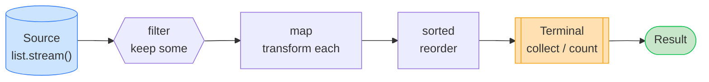
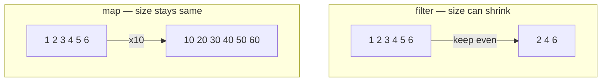
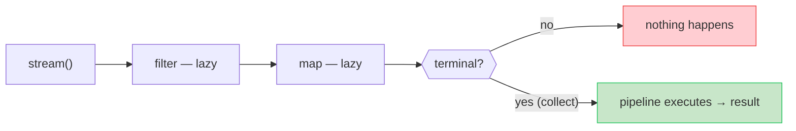
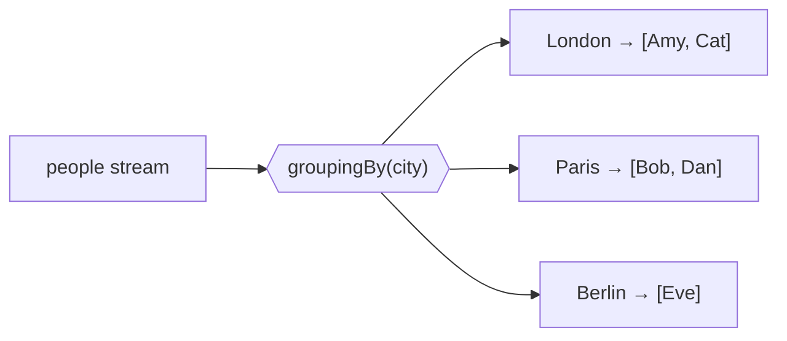
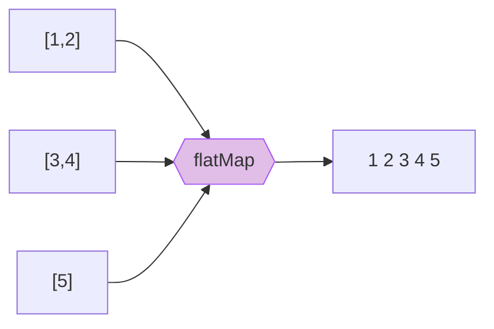
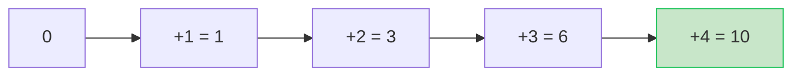
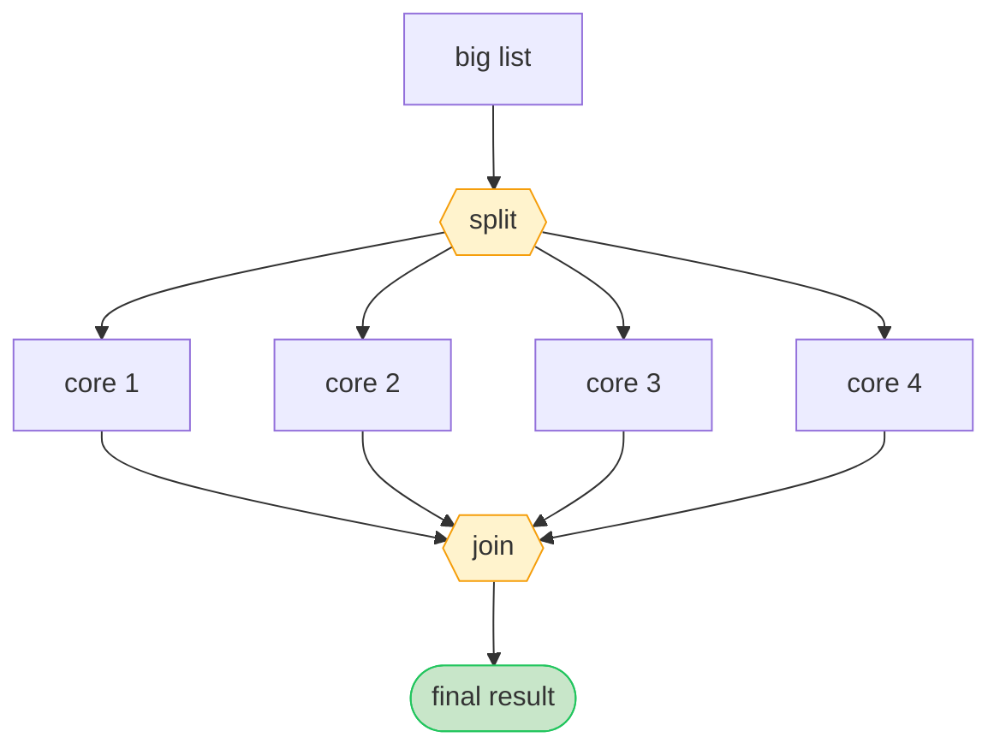
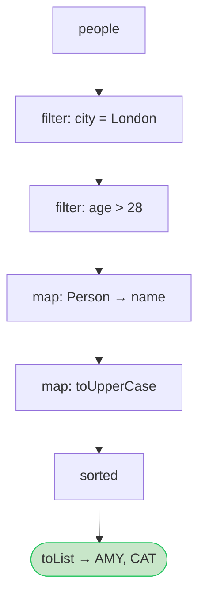

# Java 8 Streams — Visual Diagrams

Pictures for every big idea. ASCII diagrams always show; the Mermaid diagrams
render as real graphics on GitHub.

---

## 1. The big picture — a stream is a conveyor belt

```
   SOURCE                 MIDDLE STEPS (lazy)              TERMINAL (runs it)
 ┌─────────┐      ┌────────┐   ┌────────┐   ┌────────┐    ┌──────────────┐
 │ [1,2,3, │ ──►  │ filter │──►│  map   │──►│ sorted │──► │   collect    │ ──► RESULT
 │  4,5,6] │      │ even?  │   │  x10   │   │        │    │  toList()    │
 └─────────┘      └────────┘   └────────┘   └────────┘    └──────────────┘
  a List           keep/drop    transform     order         build answer

   original list is NEVER changed ───────────────────────────► new result
```



---

## 2. filter vs map — the #1 confusion

```
filter  =  KEEP or DROP items        (count can shrink)
─────────────────────────────────────────────────────────
 input :   1   2   3   4   5   6
           │   │   │   │   │   │       test: is it even?
           ✗   ✓   ✗   ✓   ✗   ✓
               │       │       │
 output:       2       4       6        ◄── 3 items left


map  =  TRANSFORM each item          (count stays the same)
─────────────────────────────────────────────────────────
 input :   1   2   3   4   5   6
           │   │   │   │   │   │       rule: multiply by 10
           ▼   ▼   ▼   ▼   ▼   ▼
 output:  10  20  30  40  50  60        ◄── still 6 items
```



---

## 3. Lazy evaluation — nothing runs until the terminal step

```
  WITHOUT a terminal step:                 WITH a terminal step:

  list.stream()                            list.stream()
      .filter(...)   ⏸ pipeline built          .filter(...)   ▶ runs
      .map(...)      ⏸ but NOT run             .map(...)      ▶ runs
                     ⏸ nothing happens          .toList()      ▶ TRIGGERS all
        (no result)                              ► returns the result
```

Items are also pulled **one at a time** all the way through (not layer by layer):

```
 element 5 ─► filter ✓ ─► map ─► collect
 element 2 ─► filter ✓ ─► map ─► collect
 element 9 ─► filter ✓ ─► map ─► collect
            (each element flows through the WHOLE pipeline before the next)
```



---

## 4. groupingBy — sorting items into labelled buckets

```
 people ─►  classify by city  ─►            Map<String, List<Person>>
 ┌──────────────────────┐
 │ Amy(London)          │                ┌─────────┐
 │ Bob(Paris)           │   group by     │ London  │──► [Amy, Cat]
 │ Cat(London)          │   city         ├─────────┤
 │ Dan(Paris)           │  ───────────►  │ Paris   │──► [Bob, Dan]
 │ Eve(Berlin)          │                ├─────────┤
 └──────────────────────┘                │ Berlin  │──► [Eve]
                                          └─────────┘
```

Add a downstream collector to aggregate inside each bucket:

```
 groupingBy(city, counting())   ──►  { London=2, Paris=2, Berlin=1 }
 groupingBy(city, averagingInt(age)) ─► { London=32.5, Paris=32.5, Berlin=28.0 }
```



---

## 5. flatMap — unpack lists-of-lists into one flat stream

```
 nested:   [ [1,2] , [3,4] , [5] ]

           map(...)  would give a Stream of Streams  ✗ still nested
           flatMap   glues the inner items together  ✓

   [1,2]  ─┐
   [3,4]  ─┼──► flatMap ──►  1  2  3  4  5      (one flat list)
   [5]    ─┘
```



---

## 6. reduce — fold everything into ONE value

```
  reduce(0, (a,b) -> a + b)   on   [1, 2, 3, 4]

   start = 0
        0 + 1  = 1
            1 + 2  = 3
                3 + 3  = 6
                    6 + 4  = 10   ◄── final single value
```



---

## 7. Optional — the "maybe empty box"

```
 findFirst() / max() may find nothing, so they return an Optional:

   ┌───────────────┐            ┌───────────────┐
   │  Optional     │            │  Optional     │
   │  [ "Bob" ]    │  present   │   [ empty ]   │  absent
   └───────┬───────┘            └───────┬───────┘
           │                            │
   .orElse("none") ─► "Bob"     .orElse("none") ─► "none"
   .ifPresent(...)  ─► runs      .ifPresent(...)  ─► skipped
```

---

## 8. Sequential vs Parallel — one worker vs many

```
 SEQUENTIAL  (one thread, in order)
   [────────────── all 8 items ──────────────]  ► one worker, item by item

 PARALLEL  (split → many threads → join)
   [ 1 2 ] [ 3 4 ] [ 5 6 ] [ 7 8 ]   ◄ split into chunks
      │       │       │       │
   core1   core2   core3   core4      ◄ processed at the SAME time
      └───────┴───┬───┴───────┘
              join results           ► combine into final answer

 worth it ONLY for: big data + heavy CPU work + associative ops + no I/O
```



---

## 9. Intermediate vs Terminal — the cheat picture

```
 ┌──────────────────────── INTERMEDIATE (returns a Stream) ─────────────────────┐
 │  filter   map   flatMap   sorted   distinct   limit   skip   peek   parallel  │
 │  • lazy   • chain as many as you like   • do nothing on their own             │
 └──────────────────────────────────────────────────────────────────────────────┘
                                    │
                                    ▼  (exactly ONE ends the pipeline)
 ┌──────────────────────────── TERMINAL (returns a value) ───────────────────────┐
 │  collect   forEach   count   reduce   findFirst   anyMatch   min/max   sum     │
 │  • triggers execution   • closes the stream (single use)                       │
 └────────────────────────────────────────────────────────────────────────────────┘
```

---

## 10. One full pipeline, drawn end to end

Task: **names of Londoners older than 28, UPPERCASE, sorted.**

```
 people
   │
   ▼  .filter(city == London)      Amy✓  Bob✗  Cat✓  Dan✗  Eve✗
   │                               ──► [Amy(30), Cat(35)]
   ▼  .filter(age > 28)            both pass
   │                               ──► [Amy, Cat]
   ▼  .map(Person::name)           ──► ["Amy", "Cat"]
   │
   ▼  .map(toUpperCase)            ──► ["AMY", "CAT"]
   │
   ▼  .sorted()                    ──► ["AMY", "CAT"]
   │
   ▼  .toList()                    ◄── RESULT: [AMY, CAT]
```



> Tip: GitHub renders the ```mermaid``` blocks as real diagrams. In a plain text
> editor you'll just see the ASCII versions — which is fine, they say the same thing.
